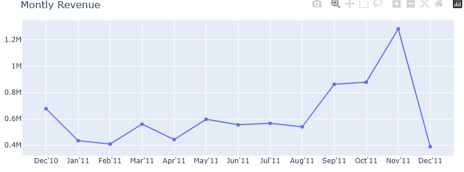
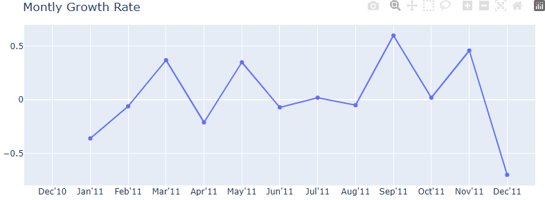
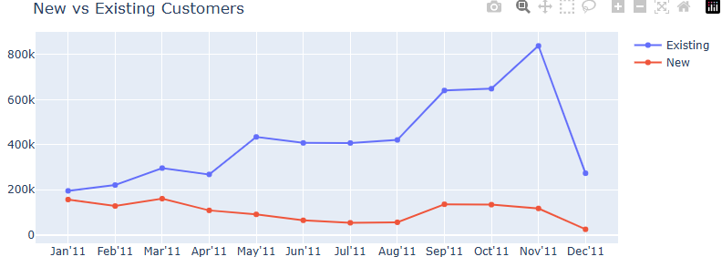
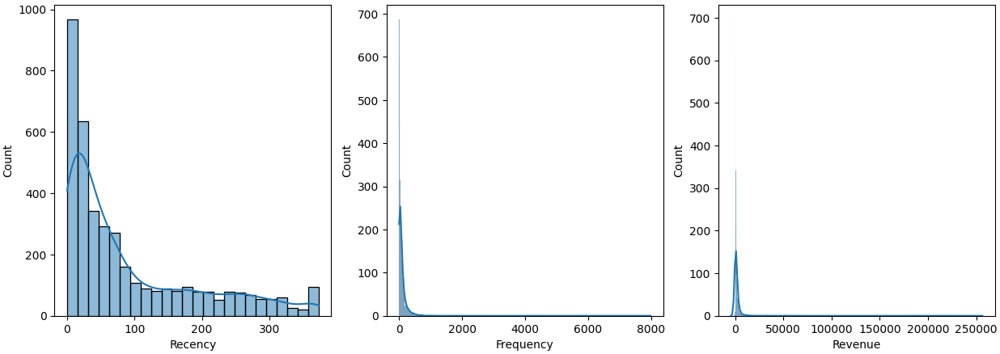
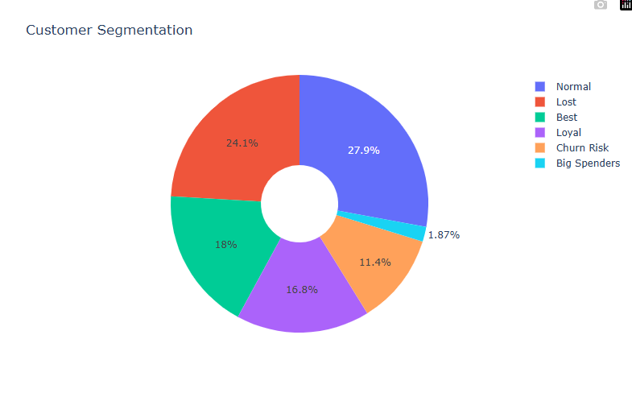
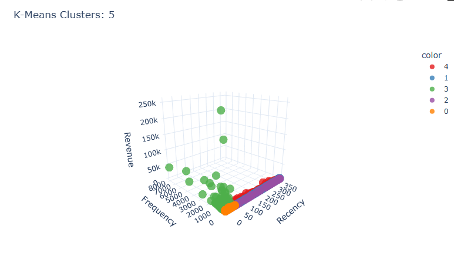
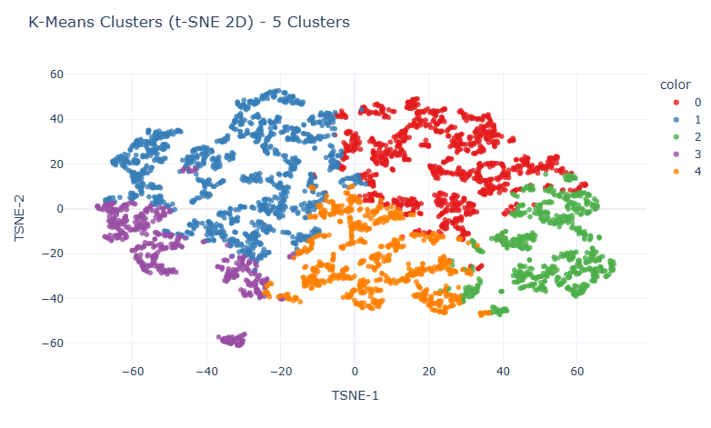

# CustomerSegmentation-RFM-KMeans
## About
This project performs customer segmentation using RFM (Recency, Frequency, and Monetary) analysis and K-Means clustering on a dataset of transactions. The goal is to identify different customer groups and derive insights for improving business strategies.

## Methodology
### Feature Engineering
* Engineered features such as monthly revenue, monthly growth rate, monthly active customers, and new customers from the transaction data.
* Derived RFM (Recency, Frequency, Monetary) features.

### EDA
* Monthly Revenue Trends:

  
  * stable growth from Jan to Aug
  * significant revenue spikes in Sep and Nov, with peak sales in Nov 2011.
* Monthly Growth Rate:

  
  * decline of 21% in April.
  * rapid growth of 60% in September and 46% in November.
* Customer Trends:

  
  * Existing customers show a positive trend, but the number of new customers is not increasing.
  * New customer ratio has declined over time.
 
### Feature Transformation
* log transformation on RFM features, which were all heavily right-skewed.
  
  
  * distance based models perform best when data is not skewed.
 
### RFM Clustering

* clusters were sorted on a ranking basis, with 1 being the best-case scenario for each feature.
* points were assigned to a cluster based on pre-defined filters on RFM set for each cluster.
* achieved a davies-bouldin score of 2.05.

### RFM Recommendations
* Best Customers - who are very active, buy frequently, and make high value purchases
  * keep them engaged and reward loyalty
  * personalized rewards: exclusive discounts and early access to sale
  * goal: maintain their engagement and increase lifetime value
* Loyal Customers - who are active and frequent buyers, but not of high value
  * subscription plans: points based membership that can be redeemed during next purchase
  * goal: increase revenue per customer through higher engagement
* Bigtime Spenders - who spend a lot, but don't buy frequently
  * limited time offers: create urgency with time sensitive deals
  * premium products: offer premium and exclusive products to cater to their high spending
  * goal: increase their purchase frequency, while maintaining high spending
* Churn Risk - who were once valuable, but have started disengaging
  * reminder mails: mails containing details about cost savings of past purchases
  * best discount deals: provide them with the highest discount deals available on the market to bring them back to the store
  * goal: prevent them from moving to the "Lost" category
* Lost - who haven't purchased in a long time and might have found an alternative
  * survey: to understand why they left and receive feedback
  * filtered marketing: only market to the high value ones
  * goal: reactivate high value lost customers, while filtering out the low value ones
* Normal - who make regular purchases but haven't reached "Loyalty" category yet
  * loyalty incentives: encourage repeat purchases with small rewards
  * goal: convert them into loyal customers

### K-Means Clustering
* elbow method was used for finding the optimal number of cluster which turned out to be 5.
* 3D scatter plot was used to visualize the clusters.

  
* TSNE was used to perform dimensionality reduction and visualize the clusters in 2D.

  
* achieved the lowest davies-bouldin score of 0.92.

### K-Means Recommendations
* Potential Loyalist (0): active + moderate freq + mid revenue
  * Offer loyalty programs and exclusive discounts: Build long-term relationships with customers who show potential for increased loyalty. Rewarding them early can solidify future engagement.
  * Cross-sell based on past purchases: Suggest complementary products that align with their interests, increasing the chance of repeat purchases.
* Churn Risk (1): inactive + low freq + low revenue
  * Re-engagement email campaign: Target with personalized emails offering incentives or addressing their specific needs to spark their interest and bring them back into the fold.
  * Offer significant discounts or promotions: Entice them to return with a one-time offer that captures their attention, driving them to take action.
* Lost Customers (2): very inactive + very low freq + no revenue
  * Survey to identify reasons for churn: Understand the root causes of their disengagement through surveys, providing valuable insights for future retention efforts.
  * Remove from marketing lists: To avoid wasting marketing resources, exclude them from campaigns, optimizing your budget and targeting more promising customers.
* Best Customers (3): very active + very high freq + very high revenue
  * Provide priority customer service: Recognize their value by offering enhanced support, ensuring their needs are met quickly and efficiently.
  * Invite to VIP memberships: Offer exclusivity by inviting them to special clubs, creating a sense of privilege that enhances loyalty.
  * Early access to discounts and special offers: Make them feel appreciated by offering first dibs on promotions, keeping them engaged and more likely to continue high-level spending.
* Frequent Big Spenders (4): active + high freq + high revenue
  * Encourage higher-value purchases: Present high-end products or upgrades that align with their preferences, fostering greater spending.
  * Provide attractive discounts for further purchases: Offer personalized promotions to incentivize repeat purchases or upsell them to higher-value items.
 
## Results
K-Means clustering performed better than RFM clustering by achieving a 55% lesser davies-bouldin score.
